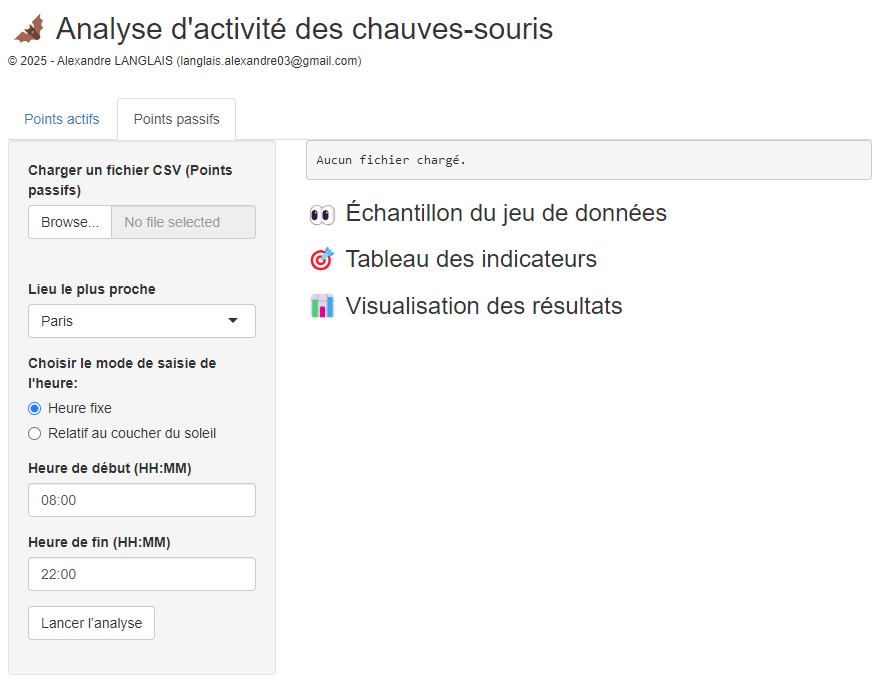

# 🦇 BatActivity

## Un ensemble de fonctions utiles pour les analyses chiroptérologiques

[](https://creativecommons.org/licenses/by-nc/4.0/)
[](https://cran.r-project.org/)
[](https://a-langlais.shinyapps.io/bat_activity/)
[](https://github.com/a-langlais/bat_activity/commits/main)

## Présentation de l’application

<p align="center">
  
</p>

**BatActivity** est une application R et un ensemble de fonctions conçus pour faciliter l’analyse de l’activité des chauves-souris, que ce soit par écoute passive (via enregistreurs automatiques) ou active (hétérodyne).

L'application Shiny permet :

- 🔍 Une sélection interactive des colonnes selon les fichiers importés  
- 🌇 Un paramétrage dynamique via le choix d'une ville (lever/coucher du soleil adaptés)  
- 📊 Des visualisations graphiques interactives avec `plotly` ou `ggplot2`  
- 👥 Une meilleure accessibilité aux analyses, même pour les non-spécialistes

L'application est directement accessible sur votre navigateur web via ShinyApps : https://a-langlais.shinyapps.io/bat_activity

> **⚠️ IMPORTANT:**  
> Toutes les données traitées par l'application sont exclusivement utilisées de manière instantanée. Aucune donnée n'est sauvegardée, stockée ou visible par un tiers. Chaque session est totalement indépendante et les informations sont supprimées dès que la session est terminée. Vous pouvez ainsi utiliser l'application en toute sécurité, sans craindre la conservation de vos données.

## Organisation du repo

```bash
bat_activity/
├── data/                     # Données d'entrée et exemples
├── images/                   # Images utilisées
├── output/                   # Résultats générés par les scripts
├── src/                      # Scripts indépendants
│   └── app/                  # scripts utilisés par l'app Shiny
├── .gitignore                # Fichiers et répertoires à ignorer par Git
├── LICENSE                   # Licence du projet (CC0-1.0)
├── README.md                 # Documentation principale du projet
├── app.R                     # Application Shiny 
├── packagesRequirements.R  # Script d'installation des dépendances
```

### Lancer l’application Shiny

```r
install.packages(c("shiny", "plotly", "suncalc"))
runApp("~/bat_activity/app.R")
```

## Fonctions principales

Les scripts restent utilisables sans l'obligation systématique de passer par l'application.

### `TableFormatage()`

Convertit un tableau brut (SonoChiro ou Tadarida) en un format standard exploitable. Etape indispensable pour utiliser les fonctions qui vont suivre.

```r
# Exemple pour SonoChiro
data <- TableFormatage(table = resultats_brut_sonochiro, sftw = "SonoChiro")

# Exemple pour Tadarida
data <- TableFormatage(table = resultats_brut_tadarida, sftw = "Tadarida")
```

### `BatActive()`

Calcule les indicateurs d’activité par point pour des écoutes actives (richesse spécifique, nombre de contacts, contacts par heure estimé et proportion de chaque activité observée).

```r
# Exemple : 6 points de 10 min
results <- BatActive(table = data, duration = 10, npoint = 6)
```

### `SpeciesPlaceActivity()`

Analyse l’activité passive par espèce, lieu et période horaire (nombre de contacts, nombre de nuits, heures et minutes positives, nombre de contacts par nuit et nombre de contact par heure).

⚠️ Attention, les résultats ne sont pas corrigés par un facteur de détection.

```r
# Exemple : 1 nuit de 22:00 à 06:00
results <- SpeciesPlaceActivity(data = data, nights = 1, record_time = c("22:00", "06:00"))
```

### `CalculateThreshold()`

Calcule des seuils de bridage selon variables météo (ex : température, vent).

```r
CalculateThreshold(
  data = data,
  meteo = meteo,
  dates = c("01-06-2018", "31-07-2018"),
  var = c("Speed", "Temperature"),
  percent = 95,
  plot = TRUE
)
```

### `list.renamer()`

Renomme automatiquement les fichiers .wav dans un répertoire.

```r
setwd("mon_dossier_wav")
files <- list.files(pattern = ".wav", ignore.case = TRUE)
list.renamer(files)
```

### `print_Signal()`

Affiche la courbe de signal d’un test micro de TeensyRecorder. Pour obtenir le fichier *.txt en question, suivre la procédure de test micro étendu des TeensyRecorders.

```r
print_Signal()
```

## Format des tableaux standards

### Écoute passive


Colonnes clés :

- `File`, `Place`, `Id`
- `Night_Date`, `Date_Time`, `Date`, `Year`, `Month`, `Week`, `Day`, `Time`, `Hour`, `Minute`

### Écoute active


Colonnes clés :

- `File_name`, `Id`, `Activity`, `Place`
- `Date`, `Night_Date`, `Time`, `Year`, `Month`, `Day`, `Hour`, `Minute`

## Installation

### 1. Cloner le dépôt

```bash
git clone https://github.com/a-langlais/bat_activity.git
```

### 2. Vérifier R

```r
R --version
```

> 📌 Requiert R ≥ 3.6.0

## Dépendances

### Fonctionnalités générales :

```r
install.packages(c("dplyr", "tidyr", "ggplot2", "lubridate", "suncalc"))
```

### Application Shiny :

```r
install.packages(c("shiny", "readr", "here", "plotly", "tibble"))
```

❗**Pour vous faciliter la tâche, il est possible de lancer le script `packagesRequirements.R` qui installera automatiquement les dépendances aux bonnes versions**❗

## Contributions

Ce projet est ouvert à la contribution !  
Si vous êtes chiroptérologue, data scientist ou simplement curieux, vos retours, issues ou pull requests sont les bienvenus.

## Licence

Ce projet est sous licence **[CC BY-NC 4.0](https://creativecommons.org/licenses/by-nc/4.0/)**.  
Vous pouvez le partager, l’adapter et l’utiliser **à des fins non commerciales**, en mentionnant l’auteur original.

---
