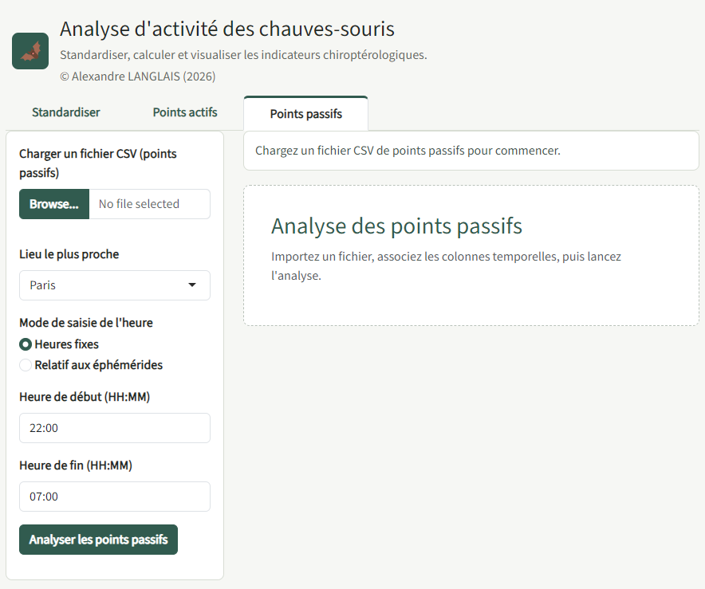

## BatActivity : ensemble de fonctions utiles à l'analyse de l'activité des chauves-souris

### Présentation

Ce projet regroupe un certain nombre de fonctions utiles pour l'analyse des données chiroptérologiques obtenues par protocole d'écoute active (hétérodyne) ou passive (via enregistreurs automatiques).
**Il est en constante évolution au fur et à mesure des besoins et des problèmes rencontrés. De plus, il est ouvert à la contribution**

Il propose par ailleurs un format standard de tableau à utiliser pour les données chiroptérologiques, facilitant l'analyse et les comparaisons. Il est indispensable de suivre ce format standard pour le bon fonctionnement des fonctions.

Il s'agit de plusieurs fonctions que j'utilise dans le cadre de mes analyses en tant que chiroptérologue. Les fonctions calculent le nombre de contacts, le nombre de minutes positives, d'heures positives et les différents paramètres des contacts par heure (CPH) et contacts par nuit (CPN). Concernant les données actives, la fonction montre le nombre de CPH estimé (calculé sur une heure) et les proportions des trois comportements qualifiés ('Transit' pour un comportement de déplacement, 'Chasse' pour un comportement de chasse et 'Social' pour un cri à caractère social).

### Organisation du dépôt

Le dépôt est organisé en trois espaces principaux :

```text
bat_activity/
├── batactivity/              # Package R installable
│   ├── DESCRIPTION
│   ├── NAMESPACE
│   ├── R/
│   ├── man/
│   ├── tests/testthat/
│   └── inst/extdata/          # Petits fichiers exemples standardisés
├── shiny-app/                 # Application Shiny indépendante
│   ├── app.R
│   ├── R/
│   ├── www/
│   └── rsconnect/
├── scripts/                   # Scripts one-shot reproductibles
│   ├── 01_standardiser_table.R
│   └── 02_export_visualisations.R
├── data/                      # Données exemples ou données projet
├── output/                    # Sorties générées localement
├── README.md
└── LICENSE
```

Le dossier `batactivity/` contient la base du package R. Les scripts ponctuels restent dans `scripts/` et doivent partir autant que possible de tableaux déjà convertis au format standard BatActivity.

Installation locale du package :

```bash
R CMD INSTALL batactivity
```

### Les principales fonctions

La fonction **`standardize_table()`** convertit un tableau de sortie Tadarida ou Sonochiro en un format standard pour l'utilisation des scripts. La fonction renvoie un tableau. L'ancien nom `TableFormatage()` reste disponible comme wrapper de compatibilité.

```R
# Pour convertir un tableau de sortie SonoChiro
data <- standardize_table(data = resultats_brut_sonochiro, software = "SonoChiro")
# Pour convertir un tableau de sortie Tadarida
data <- standardize_table(data = resultats_brut_tadarida, software = "Tadarida")
```

La fonction **`bat_active()`** prend en arguments : le tableau standard, la durée des points en minutes et le nombre de points réalisés. La fonction renvoie un tableau. L'ancien nom `BatActive()` reste disponible.

```R
# Pour une session de 6 points d'écoute de 10 minutes
results <- bat_active(data = data, duration = 10, npoint = 6)
```

La fonction **`species_place_activity()`** prend en arguments : le tableau standard, le nombre de nuits enregsitrées, et l'heure de début et de fin dans un vecteur. La fonction renvoie un tableau. L'ancien nom `SpeciesPlaceActivity()` reste disponible.

```R
# Pour une session d'une nuit enregsitrée de 22:00 à 06:00
results <- species_place_activity(data = data, nights = 1, record_time = c("22:00", "06:00"))
```

La fonction **`calculate_threshold()`** prend en arguments : le tableau standard, le tableau des données météorologiques, les dates de début et de fin dans un vecteur, les variables abiotiques a étudier et le pourcentage de sauvegarde de contacts visé. La visualisation est séparée dans `plot_threshold()`. L'ancien nom `CalculateThreshold()` reste disponible.

```r
# Pour calculer l'influence des variables abiotiques sur les contacts de chauves-souris sur la période juin-juillet avec un souhait de conserver 95% de l'activité
calculate_threshold(data = data, weather = meteo, dates = c("01-06-2018", "31-07-2018"), variables = c("Speed", "Temperature"), percent = 95)
```

La fonction **`rename_audio_files()`** prend en argument une liste de fichiers *.wav. Par défaut, elle renvoie seulement le plan de renommage ; le renommage réel demande `dry_run = FALSE`. L'ancien nom `list.renamer()` reste disponible.

```R
setwd() # répértoire du script
files <- list.files(pattern = ".wav", ignore.case = TRUE)
rename_audio_files(files)
```

Les fonctions **`read_microphone_test()`** et **`plot_microphone_test()`** lisent et visualisent un fichier *.csv de sortie d'un test micro étendu d'un TeensyRecorder. L'ancien nom `print_Signal()` reste disponible, mais demande maintenant un chemin de fichier explicite.

```R
test <- read_microphone_test("TR_test_micro.csv")
plot_microphone_test(test)
```

D'autres scripts permettent de réaliser diverses opérations comme visualiser les seuils de bridage en fonction de la température et de la vitesse du vent.

### Tableaux standards

Le format standard des tableaux est indispensable pour la bonne réalisation des fonctions et pour s'assurer que les données saisies soient de bonne qualité. De plus, cela facilite la concaténation si vous souhaitez réaliser une base de données. 
Si vous êtes passés par un logiciel de clustering automatique comme Sonochiro ou la plateforme Tadarida, vous pouvez utiliser la sortie de ces logiciels pour le convertir en un tableau standard avec la fonction `standardize_table()`. Pour le moment, tous les titres sont en anglais mais bientôt les fonctions prendront en charge des titres de colonnes en français et en anglais.

Concernant les données de protocole d'écoute passive, un tableau exemple bien saisi et prêt à l'utilisation est présenté comme ci-dessous : 


- `File` est le nom du fichier son enregistré.
- `Place` est l'identifiant du point d'écoute.
- `Id` est le nom de l'espèce identifiée.
- `Night_Date` est la date de la nuit de l'enregistrement.
- `Date_Time` est la date et l'heure précise de l'enregistrement.
- `Date`, `Year`, `Month`, `Week`, `Day`, `Time`, `Hour` et `Minute` sont les décompositions de la date de l'enregistrement.

Pour les données de protocole d'écoute active, un tableau exemple bien saisi est comme ci-dessous :


- `File_name` est le nom du fichier son enregistré (s'il y a eu).
- `Id` est le nom de l'espèce identifiée.
- `Activity` est la qualification du comportement dominant du contact ('Transit' pour du déplacement, 'Chasse' pour un buzz de chasse et 'Social' pour un comportement social).
- `Place` est l'identifiant du point d'écoute.
- `Year`, `Month`, `Day`, `Hour` et `Minute` sont les décompositions de la date de l'enregistrement.
- `Date` est la date civile du contact.
- `Time` est l'heure du contact.
- `Night_Date` est la date de la nuit de l'enregistrement.

### Application Shiny

<p align="center">
  
</p>

Pour faciliter l’analyse et la visualisation des données, notamment lorsque les jeux de données sont complexes, atypiques ou contiennent des noms de colonnes spécifiques, une application Shiny a été développée.

Cette interface conviviale permet :
    * Une sélection interactive des données : Choix des colonnes pertinentes selon la structure du fichier importé, évitant ainsi les erreurs de saisie ou d’incohérences.
    * Un paramétrage dynamique des analyses : Par exemple, la possibilité de sélectionner une ville dans une liste déroulante, pour adapter automatiquement les calculs liés à l’environnement (lever et coucher du soleil) grâce à des coordonnées géographiques associées.
    * Une visualisation graphique interactive avec plotly (ou ggplot2) pour explorer les activités au fil du temps, avec des superpositions d’événements naturels (comme le lever et le coucher du soleil calculés avec suncalc).
    * Une meilleure compréhension des données grâce à des graphiques clairs, interactifs et ajustés au contexte choisi.

Cette application vise ainsi à réduire les erreurs de manipulation, à offrir une exploration intuitive des données, et à rendre accessible à tous les utilisateurs, même non spécialistes, une analyse fine et standardisée.

Pour lancer l'application Shiny, assurez-vous d'avoir installé R ainsi que les dépendances nécessaires. Ensuite, lancez l'application en exécutant le script principal :
```r
install.packages(c("shiny", "plotly", "suncalc"))
shiny::runApp("~/bat_activity/shiny-app")
```

### Prérequis

Avant d'installer et d'exécuter le script, vous devez vous assurer que votre système dispose de R et des packages R nécessaires. Voici les étapes pour vérifier et installer les prérequis :

Le script est écrit pour être exécuté dans l'environnement R. Vous devez avoir R version 3.6.0 ou ultérieure installé sur votre machine. Pour vérifier si R est installé et connaître sa version, ouvrez un terminal ou une console R et exécutez :

```R
R --version
```

Si R n'est pas installé, vous pouvez le télécharger et l'installer depuis CRAN.

Ensuite, vous pouvez cloner le dépôt sur votre machine locale via votre méthode préférée ou en utilisant la commande suivante :

```bash
git clone https://github.com/a-langlais/BatActivity.git
```

### Dépendances

Les fonctions de calcul du package utilisent maintenant uniquement R base. Les fonctions de visualisation optionnelles utilisent `ggplot2`.

```R
install.packages("ggplot2")
```

Pour l'application :
```R
install.packages("shiny")
install.packages("readr")
install.packages("dplyr")
install.packages("plotly")
install.packages("lubridate")
install.packages("suncalc")
install.packages("tibble")
```

## License

Ce projet est sous licence [Creative Commons Attribution-NonCommercial 4.0 International License (CC BY-NC 4.0)](https://creativecommons.org/licenses/by-nc/4.0/).  
Vous pouvez l'utiliser, le partager, l'adapter seulement pour une utilisation non-commerciale.
